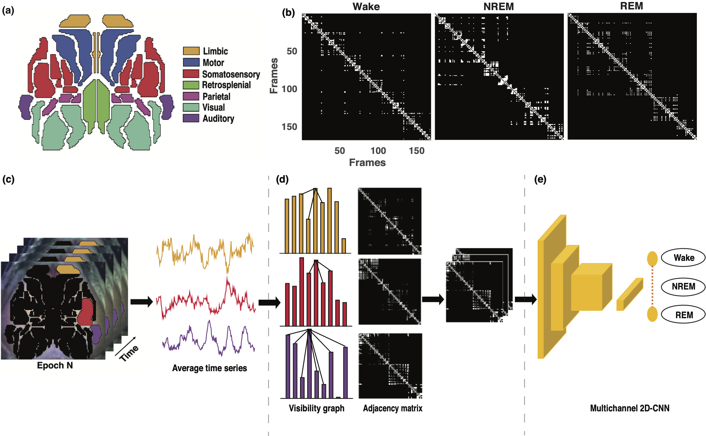

# Automated sleep stage classification of wide-field calcium imaging data via multiplex visibility graphs and deep learning

**Authors:** Zhang X, Landsness EC, Chen W, Miao H, Tang M, Brier LM, Culver JC, Lee JM, Anastasio MA <br />
University of Illinois at Urbana-Champaign, Urbana, IL - 61801, USA <br>
Washington University School of Medicine<br>
Washington University School of Engineering<br>

**Contact:** xiaohui8@illinois.edu, maa@illinois.edu

**Abstract:** Wide-field calcium imaging (WFCI) allows for monitoring of cortex-wide neural dynamics in mice. When applied to the study of sleep, WFCI data are manually scored into the sleep states of wake, non-REM (NREM) and REM by use of adjunct EEG and EMG recordings. However, this process is time consuming and often suffers from low inter- and intra-rater reliability and invasiveness. Therefore, an automated sleep state classification method that operates on WFCI data alone is needed. A hybrid, two-step method is proposed. In the first step, spatial-temporal WFCI data is mapped to a multiplex visibility graph (MVG). Subsequently, a two-dimensional convolutional neural network (2D CNN) is employed on the MVGs to be classified as wake, NREM and REM.
<p align="center">

</p>

## System Requirements
- Linux
- MATLAB
- Miniconda >= 4.8.3
- Python 3.7.6. 
- Tensorflow 2.2.0.
- NVIDIA driver >= 440.59, CUDA toolkit >= 10.0
- SciPy, NumPy, scikit-image, sklearn, matplotlib.
- [Focal loss package](https://github.com/artemmavrin/focal-loss).
- [Fast natural visibility graph MATLAB package](https://www.mathworks.com/matlabcentral/fileexchange/70432-fast-natural-visibility-graph-nvg-for-matlab).

The conda environment including all necessaray packages can be created using file `environment.yml`:
```
conda env create --file environment.yml
```
 
## Dataset
The WFCI data in this paper is available at PhysioNet: 

## Construction of multiplex visibility graph
The directory `MVG` contains the following sub-directories:
- `atlas.mat`: variables for defining Paxinos atlas
- `define_rois.m`: function used for defining which parcels will be used to construct MVG
- `parcel2trace.m`: function to compute the avarage time series for each parcel
- `extrac_MVG.m`: the main script to construct MVG

The construction of MVG is based on MATLAB, simply modify the data path highlighted in comment and run `extract_MVG.m`.

## Classifying sleep on MVG with deep learning
The directory `network training` contains the top level scripts:
- `dataloader_MVG.py`: Script for loading the MVG representations from WFCI data epochs
- `model_cnn2d.py`: Script for the compact 2D CNN to classify sleep
- `utils.py`: script to compute evaluation metrics
- `config.txt`: example txt. file for defining list of subjects used in training and validation
- `train.sh`: Scripts for running the network training.
- `checkpoints`: checkpoints for best model

To train the network, make sure to 
- Modify the data path highlighted in comment in `dataloader_MVG.py`.
- Make you own `config.txt` listing the training/validation mouse name.
- Define parameters in bash script `train.sh` and run `chmod u+x train.sh` to make the script executable.
- Simply run `./train.sh` to start your training 

## Citations
```
```
## References
```
1. Iacobello, G., Ridolfi, L., & Scarsoglio, S. (2021). Large-to-small scale frequency modulation analysis in wall-bounded turbulence via visibility networks. Journal of Fluid Mechanics, 918.
Chicago	
2. Iacobello, G., Marro, M., Ridolfi, L., Salizzoni, P., & Scarsoglio, S. (2019). Experimental investigation of vertical turbulent transport of a passive scalar in a boundary layer: Statistics and visibility graph analysis. Physical Review Fluids, 4(10), 104501.
3. Paxinos, G., & Franklin, K. B. (2019). Paxinos and Franklin's the mouse brain in stereotaxic coordinates. Academic press.
Chicago	
```


